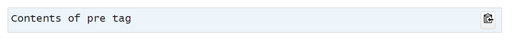
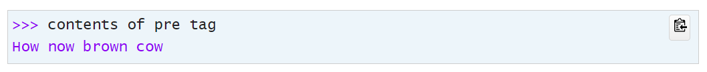

Jekyll_pre
[](https://badge.fury.io/rb/jekyll_pre)
===========

This Jekyll plugin provides 2 new Liquid tags that work together:

  * A `pre` block tag that can optionally display a copy button.
    ```
    
    Contents of pre tag
    
    ```
    The generated &lt;pre>&lt;/pre> tag has an `data-lt-active="false"` attribute, so [LanguageTool](https://forum.languagetool.org/t/avoid-spell-check-on-certain-html-inputs-manually/3944) does not check the spelling or grammar of the contents.
  * A `noselect` tag that can renders HTML content passed to it unselectable.
    ```
    
    Contents of pre tag
    
    ```

## CSS
Below are the CSS declarations that I defined pertaining to the pre and noselect tags that produced the above images:
```css
.maxOneScreenHigh {
  max-height: 500px;
}

.numbered_line,
.unselectable.numbered_line,
.numbered_line.unselectable {
  color: #5fb25f;
}

.unselectable {
  color: #7922f9;
  -moz-user-select: none;
  -khtml-user-select: none;
  user-select: none;
}
```

## Additional Information
More information is available on my web site about [my Jekyll plugins](https://www.mslinn.com/blog/2020/10/03/jekyll-plugins.html).


## Installation

Add this line to your application's Gemfile, within the `jekyll_plugins` group:

```ruby
group :jekyll_plugins do
  gem 'jekyll_pre'
end
```

And then execute:

    $ bundle install

Or install it yourself as:

    $ gem install jekyll_pre


## Usage

### Example 1
This example does not generate a copy button and does not demonstrate `noselect`.
<pre data-lt-active="false" class="maxOneScreenHigh copyContainer" id="id110c50d624b4">
Contents of pre tag
</pre>

Generates:
<pre data-lt-active="false" class="maxOneScreenHigh copyContainer" id="idddd87a0eb77d">&lt;pre data-lt-active='false' class='maxOneScreenHigh copyContainer' id='id377433c30186'&gt;Contents of pre tag&lt;/pre&gt;</pre>

Which renders as:

<pre data-lt-active="false" class="maxOneScreenHigh copyContainer" id="id377433c30186">Contents of pre tag</pre>


### Example 2
This example generates a copy button and does not demonstrate `noselect`.

    
    Contents of pre tag
    

Generates:
<pre data-lt-active="false" class="maxOneScreenHigh copyContainer" id="id08a5d26db177">&lt;pre data-lt-active='false' class='maxOneScreenHigh copyContainer' id='id6a831a3e8992'&gt;&lt;button class='copyBtn' data-clipboard-target='#id6a831a3e8992' title='Copy to clipboard'&gt;&lt;img src='images/clippy.svg' alt='Copy to clipboard' style='width: 13px'&gt;&lt;/button&gt;Contents of pre tag&lt;/pre&gt;</pre>

Which renders as (note the clipboard icon at the far right):



### Example 3
This example generates a copy button and does demonstrates the default usage of `noselect`, which renders an unselectable dollar sign followed by a space.
```

Contents of pre tag

```

Generates:

```
<pre data-lt-active='false' class='maxOneScreenHigh copyContainer' id='id1e4a8fe53480'><button class='copyBtn' data-clipboard-target='#id1e4a8fe53480' title='Copy to clipboard'></button><span class='unselectable'>$ </span>Contents of pre tag</pre>
```

Which renders as:


### Example 4
This example generates a copy button and does demonstrates the `noselect` being used twice:
the first time to render an unselectable custom prompt,
and the second time to render unselectable output.

```

Contents of pre tag


```

Generates:
```
<pre data-lt-active='false' class='maxOneScreenHigh copyContainer' id='idb58a6cf1761c'><button class='copyBtn' data-clipboard-target='#idb58a6cf1761c' title='Copy to clipboard'></button><span class='unselectable'>>>> </span>contents of pre tag
<span class='unselectable'>How now brown cow</span></pre>
```

Which renders as:




### CSS
Here are the CSS declarations that I defined pertaining to the `pre` and `noselect` tags that produced the above images:

```css
.maxOneScreenHigh {
  max-height: 500px;
}

.unselectable {
  color: #7922f9;
  -moz-user-select: none;
  -khtml-user-select: none;
  user-select: none;
}
```


### Comprehensive Example
The code I wrote to generate the above CSS was a good example of how the plugins work together with
the `from` and `to` tags from my [`from_to_until`](https://github.com/mslinn/jekyll_from_to_until) plugin:

```

{{ css | from: '.copyBtn' | to: '^$' | strip }}

{{ css | from: '.copyContainer' | to: '^$' | strip }}

{{ css | from: '.maxOneScreenHigh' | to: '^$' | strip }}

{{ css | from: '.unselectable' | to: '^$' | strip }}

```


## Development

After checking out the repo, run `bin/setup` to install dependencies.

You can also run `bin/console` for an interactive prompt that will allow you to experiment.


### Build and Install Locally
To build and install this gem onto your local machine, run:
```shell
$ rake install:local
```

The following also does the same thing:
```shell
$ bundle exec rake install
```

Examine the newly built gem:
```shell
$ gem info jekyll_pre

*** LOCAL GEMS ***

jekyll_pre (1.0.0)
    Author: Mike Slinn
    Homepage:
    https://github.com/mslinn/jekyll_pre
    License: MIT
    Installed at: /home/mslinn/.gems

    Generates Jekyll logger with colored output.
```


### Build and Push to RubyGems
To release a new version,
  1. Update the version number in `version.rb`.
  2. Commit all changes to git; if you don't the next step might fail with an unexplainable error message.
  3. Run the following:
     ```shell
     $ bundle exec rake release
     ```
     The above creates a git tag for the version, commits the created tag,
     and pushes the new `.gem` file to [RubyGems.org](https://rubygems.org).


## Contributing
1. Fork the project
2. Create a descriptively named feature branch
3. Add your feature
4. Submit a pull request


## License

The gem is available as open source under the terms of the [MIT License](https://opensource.org/licenses/MIT).
