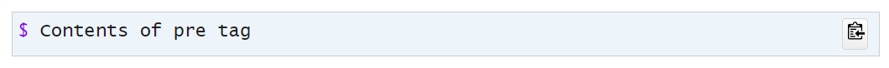

Jekyll_pre
[](https://badge.fury.io/rb/jekyll_pre)
===========

This Jekyll plugin provides 3 new Liquid tags that work together:

  * A `pre` block tag that can be displayed various ways.
    ```
    
    Contents of pre tag
    
    ```
    `Options` are:
     - `class="class1 class2"` &ndash; Apply CSS classes
     - `clear` &ndash; Line break after floating HTML elements
     - `copyButton` &ndash; Generate a copy button
     - `dark` &ndash; Dark mode
     - `label='This is a label'` &ndash; Apply text above `pre` tag.
        The `label` parameter value can also be specified in free text.
        For example, the following produce the same results:

        - <br>Contents of pre tag<br>

        - <br>Contents of pre tag<br>
     - `number` &ndash; Number the lines
     - `shell` &ndash; Equivalent to `label='Shell'`
     - `style` &ndash; Apply inline CSS styles

    The generated &lt;pre>&lt;/pre> tag has an `data-lt-active="false"` attribute, so [LanguageTool](https://forum.languagetool.org/t/avoid-spell-check-on-certain-html-inputs-manually/3944) does not check the spelling or grammar of the contents.

  * A `noselect` tag that can renders HTML content passed to it unselectable,
    and generates a <code>$</code> prompt if no content is provided.
    ```
    
    Command
    
    
    ```

  * An `exec` tag that executes shell commands and incorporates the command and its output into the content of the `pre` tag.
    Environment variables are evaluated,
    output data is escaped, whitespace is condensed, and wrapped in the same `unselectable` class as does `unselectable`.
    ```
    
    ```
    `Options` are:

     - `cd="relative/or/absolute/directory"` - Change to specified directory before executing shell command.
       Environment variables in the directory path will be expanded.
     - `die_if_nonzero` – Set `false` to treat non-zero return codes as non-fatal.
       Instead of terminating Jekyll with an error message,
       the message will be displayed as an error by the Jekyll logger,
       and a red message will appear in place of the result on the web page.
     - `die_if_error` – Set `false` to treat exceptions generated by this plugin as non-fatal.
       Instead of terminating Jekyll with an error message, the message will be displayed as an error by the Jekyll logger.
     - `no_escape` – Do not HTML escape the result of running the shell command.
     - `no_strip` – Do not remove leading and trailing whitespace from the result.
     - `wrapper_class` class applied to outer `div`.
     - `wrapper_style` style applied to outer `div`.


## CSS
See [`demo/assets/css/style.css`](demo/assets/css/style.css) for the CSS declarations,
between `/* Start of pre tag css */` and `/* End of pre tag css */`.


## Additional Information
More information is available on [my website](https://www.mslinn.com/blog/2020/10/03/jekyll-plugins.html#jekyll_pre).


## Installation

Add this line to your application's Gemfile, within the `jekyll_plugins` group:

```ruby
group :jekyll_plugins do
  gem 'jekyll_pre'
end
```

And then execute:

    $ bundle


## Usage
The following examples are rendered on [my website](https://www.mslinn.com/blog/2020/10/03/jekyll-plugins.html#jekyll_pre).

### Example 1
This example does not generate a copy button and does not demonstrate `noselect`.
<pre data-lt-active="false" class="maxOneScreenHigh copyContainer" id="id110c50d624b4">
Contents of pre tag
</pre>

Generates:
<pre data-lt-active="false" class="maxOneScreenHigh copyContainer" id="idddd87a0eb77d">&lt;pre data-lt-active='false' class='maxOneScreenHigh copyContainer' id='id377433c30186'&gt;Contents of pre tag&lt;/pre&gt;</pre>

Which renders as:

<pre data-lt-active="false" class="maxOneScreenHigh copyContainer" id="id377433c30186">Contents of pre tag</pre>


### Example 2
This example generates a copy button and does not demonstrate `noselect`.

    
    Contents of pre tag
    

Generates:
<pre data-lt-active="false" class="maxOneScreenHigh copyContainer" id="id08a5d26db177">&lt;pre data-lt-active='false' class='maxOneScreenHigh copyContainer' id='id6a831a3e8992'&gt;&lt;button class='copyBtn' data-clipboard-target='#id6a831a3e8992' title='Copy to clipboard'&gt;&lt;img src='images/clippy.svg' alt='Copy to clipboard' style='width: 13px'&gt;&lt;/button&gt;Contents of pre tag&lt;/pre&gt;</pre>

Which renders as (note the clipboard icon at the far right):


### Example 3
This example generates a copy button and does demonstrates the default usage of `noselect`, which renders an unselectable dollar sign followed by a space.
```

Contents of pre tag

```

Generates:

```
<pre data-lt-active='false' class='maxOneScreenHigh copyContainer' id='id1e4a8fe53480'><button class='copyBtn' data-clipboard-target='#id1e4a8fe53480' title='Copy to clipboard'></button><span class='unselectable'>$ </span>Contents of pre tag</pre>
```

Which renders as:




### Example 4
This example generates a copy button and does demonstrates the `noselect` being used twice:
the first time to render an unselectable custom prompt,
and the second time to render unselectable output.

```

Contents of pre tag


```

Generates:
```
<pre data-lt-active='false' class='maxOneScreenHigh copyContainer' id='idb58a6cf1761c'><button class='copyBtn' data-clipboard-target='#idb58a6cf1761c' title='Copy to clipboard'></button><span class='unselectable'>>>> </span>contents of pre tag
<span class='unselectable'>How now brown cow</span></pre>
```

Which renders as:


### Example 5
A regular expression can be passed to the `highlight` option.
This causes text that matches the regex pattern to be wrapped within a &lt;span class="bg_yellow">&lt;/span> tag.

The CSS stylesheet used for this page contains the following:

```css
.bg_yellow {
  background-color: yellow;
  padding: 2px;
}
```

This example demonstrates highlighting text that matches a regular expression. Regular expressions match against lines, which are delimited via newlines (\n).

```

Line 1
  Line 2
    Line 3
      Line 4
    Line 5
  Line 6
Line 7

```


### Example 6
Regular expressions match against lines, which are delimited via newlines (`\n`).
Thus to match an entire line that contains a phrase, specify the regex as `.*phrase.*`.
The following matches 3 possible phrases (`2`, `4` or `6`), then selects the entire line if matched.

```

Line 1
  Line 2
    Line 3
      Line 4
    Line 5
  Line 6
Line 7

```


### Example 7
This example floats an image to the right.
The `jekyll_pre plugin`’s `clear` option moves the generated HTML below the image.

```
&lt;img src="jekyll.webp" style="float: right; width: 100px; height: auto;">

Using clear, copyButton and label parameters

```

### Example 8
The following executes `ls -alF /` and displays the output.

```



```

### Example 9
The following changes to the home directory (`$HOME`), then executes `pwd` and displays the output.

```



```

### Example 10
The following executes `echo $USER` and displays the output.

```



```


### Comprehensive Example
The code I wrote to generate the above CSS was a good example of how the plugins work together with
the `from` and `to` tags from my [`from_to_until`](https://github.com/mslinn/jekyll_from_to_until) plugin:

```

{{ css | from: '.copyBtn' | to: '^$' | strip }}

{{ css | from: '.copyContainer' | to: '^$' | strip }}

{{ css | from: '.maxOneScreenHigh' | to: '^$' | strip }}

{{ css | from: '.unselectable' | to: '^$' | strip }}

```


## Development

After checking out the repo, run `bin/setup` to install dependencies.

You can also run `bin/console` for an interactive prompt that will allow you to experiment.


## Test
A test website is provided in the `demo` directory.
 1. Set breakpoints.

 2. Initiate a debug session from the command line:
    ```shell
    $ bin/attach demo
    ```

  3. Once the `Fast Debugger` signon appears, launch the Visual Studio Code launch configuration called `Attach rdebug-ide`.

  4. View the generated website at [`http://localhost:4444`](http://localhost:4444)


### Build and Install Locally
To build and install this gem onto your local machine, run:

```shell
$ bundle exec rake install
```

Examine the newly built gem:
```shell
$ gem info jekyll_pre

*** LOCAL GEMS ***

jekyll_pre (1.0.0)
    Author: Mike Slinn
    Homepage:
    https://github.com/mslinn/jekyll_pre
    License: MIT
    Installed at: /home/mslinn/.gems

    Generates Jekyll logger with colored output.
```


### Build and Push to RubyGems
To release a new version,
  1. Update the version number in `version.rb`.
  2. Commit all changes to git; if you don't the next step might fail with an unexplainable error message.
  3. Run the following:
     ```shell
     $ bundle exec rake release
     ```
     The above creates a git tag for the version, commits the created tag,
     and pushes the new `.gem` file to [RubyGems.org](https://rubygems.org).


## Contributing
1. Fork the project
2. Create a descriptively named feature branch
3. Add your feature
4. Submit a pull request


## License

The gem is available as open source under the terms of the [MIT License](https://opensource.org/licenses/MIT).
